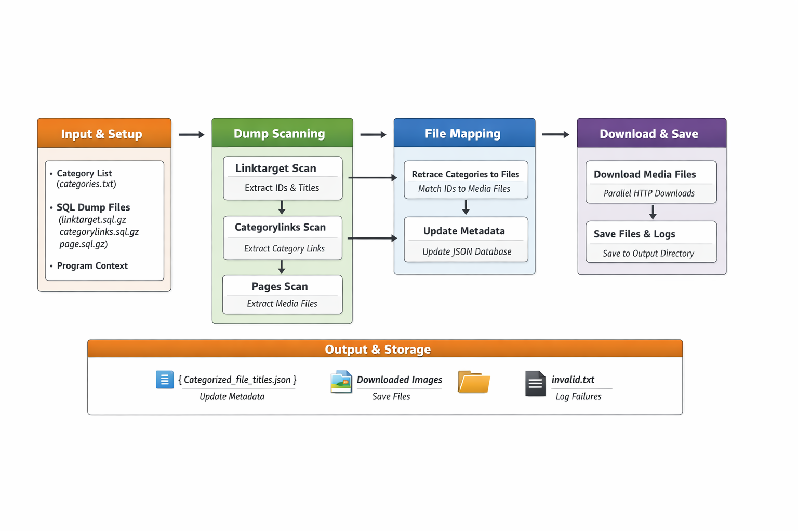

# Commons Wikimedia Bulk Downloader
Command-line interface: `cwbd`

This tool enables you to extract and download large sets of media files from **[Wikimedia commons](https://commons.wikimedia.org/)** by processing raw SQL dump files.
it does **not** use the MediaWiki API. It reads the SQL dumps directly to reconstruct media associations and perform bulk downloads.

Wiki media makes database dumps (or **[SQL dumps](https://dumps.wikimedia.org/commonswiki/latest/)**) publicly available, including category links, page tables and linktargets used by this tool.


## Features
- **Offline processing**: Operates entirely on local SQL dump files. No API acces required.
- **Category-driven downloads**: Scans and resolves all media files linked to specified Commons categories.
- **Recursive search**: Support for (nested) subcategory scanning.
- **Resumable tracking**: Keeps a JSON index of discovered files for incremental runs.
- **Multi-threaded downloader**: Efficiently fetches large numbres of files via concurrent workers.

## Installation

1. Clone the repository
```bash
git clone https://github.com/Jordieboyz/commonswiki-bulk-downloader.git
cd commonswiki-bulk-downloader
```
2. Install the package in editable mode (optionally make use of a [virtual environment](https://docs.python.org/3/library/venv.html)):
```bash
pip install -e .
```
This install the `cwbd` command globally in the active environment.  

3. Prepare\download Wikimedia Commons [SQL dumps](https://dumps.wikimedia.org/commonswiki/latest/):  
`commonswiki-latest-categorylinks.sql.gz` (~ +10GB)   
`commonswiki-latest-page.sql.gz` (~ 6GB)  
`commonswiki-latest-linktarget.sql.gz` (~ +2GB)

Place them in a directory (e.g. `./dumps`).

4. Create a category file listing desired categories (one per line), e.g. `categories.txt` 

## Usage
Run the script via the command line:
```bash
cwbd --category-file categories.txt --dumps-dir ./dumps --output-dir ./downloads --workers 10
```

### Arguments
| **Option**                | **Short** | **Type**  | **Description **                                                   
|---------------------------|-----------|-----------|------------------------------------------------------------------
| --category-file           | -c        | str       | Path to the file containing desired categories (one per line).   
| --dumps-dir               | -d        | str       | Directory containing Commons SQL dump files.                     
| --output-dir              | -o        | str       | Directory where downloaded images will be saved.                 
| --workers                 | -w        | int       | Number of parallel download threads (default: 10).               
| --no-recursive-search     |           | flag      | Disable recursive search for subcategories.                      


## Program Workflow  
  
1. Initialization  
`ProgramContext` sets up paths, loads previous progress and ensures output directories exist.
2. Load Categories  
Categories from the input file are normalized and filtered against previously processed categories.
3. Scan Dumps  
Each SQL dump is scanned sequentially:
- `linktarget_dump` -> maps link targets to titles.
- `category_dump` -> maps categories to link targets.
- `page_dump` -> maps page IDs to media filenames.
4. Retrace files  
Combine results from all dumps to asseciate files with categories.
5. Update Metadata  
`Categorized_file_titles.json` is updated with downloaded or discovered files to prevent reprocessing.
6. Download Media
- Existing files are skipped.
- Failed downloads are logged in `invalid.txt`.
- Downloads run in parallel.

## Notes
- Wikimedia Commons media dumps are not provided in a single archival image/tarbal. Tools like this help bridge that gap.
- The tool is optimized for very large Wikimedia dumps. Performace depends on available memory and CPU threads
- Ensure network connectivity for downloading media files.